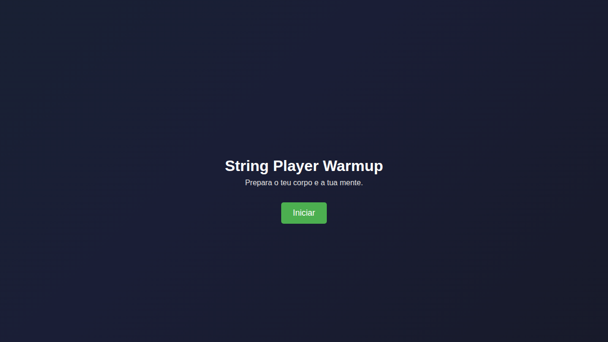
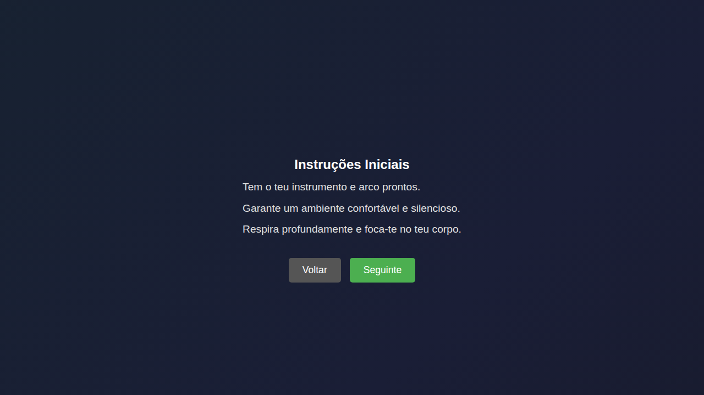
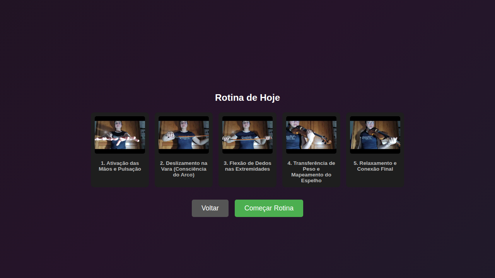
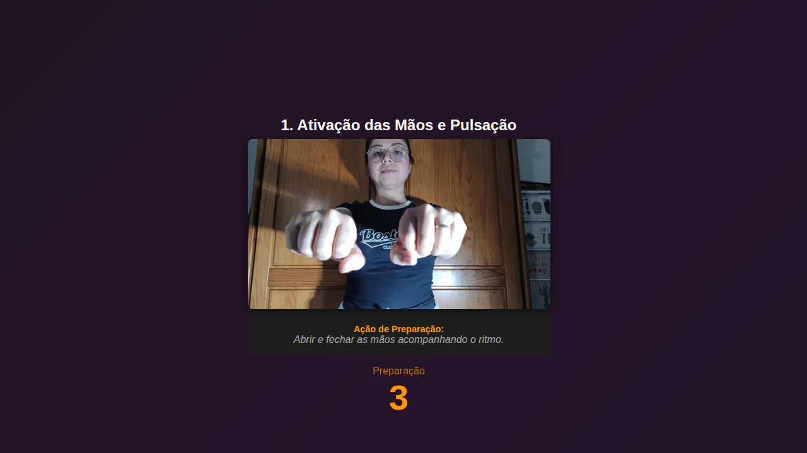
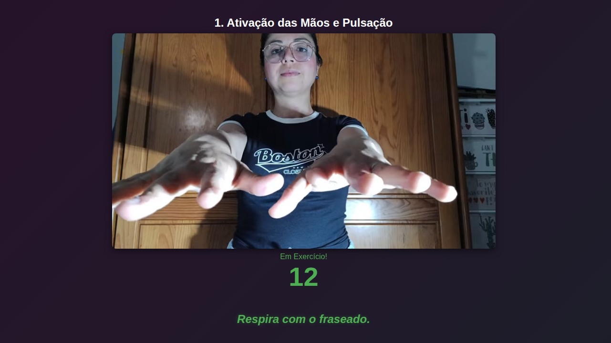
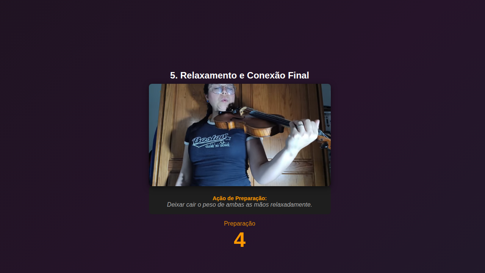
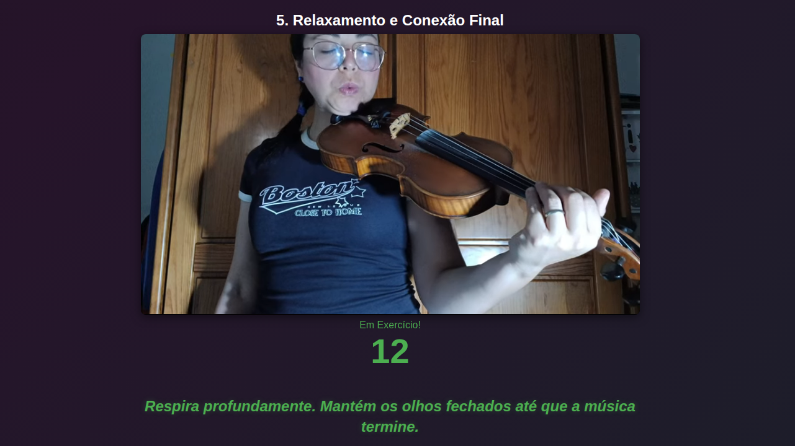
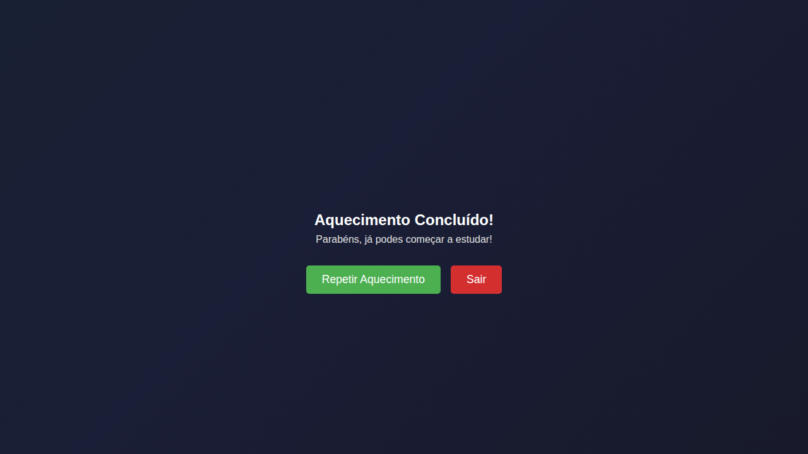

# String Player Warmup


---

## Overview

String Player Warmup is an interactive application designed for string instrument players (such as violin and cello players).
The platform provides guided warmup sessions composed of video exercises and relaxing background music. Each session is dynamically generated, ensuring that users experience different warmup routines every time they practice. This makes the training more varied, engaging, and adaptable over time.

## Warmup Session

A session consists of a sequence of 5 video exercises, with a total duration of approximately **2 minutes and 30 seconds**, structured as follows:

- **10 seconds** for each preparation screen (5 × 10s = 50 seconds)
- **20 seconds** for each exercise video (5 × 20s = 100 seconds)

Each video belongs to one of **5 exercise categories**:

1. Hand Activation and Pulse  
2. Bow Sliding (Bow Awareness)  
3. Finger Flexion at Extremities  
4. Weight Transfer and Fingerboard Mapping  
5. Relaxation and Final Connection  

Currently, each category contains **2 variations**, allowing sessions to be generated dynamically and randomly.  
This results in up to **2⁵ = 32 possible unique warmup sessions**, ensuring variety and avoiding repetition.

## How it works

The main objective is to complete a warmup session across 5 different categories.

The application guides the user through a structured warmup flow:

---

### 1. Home Screen

<p align="left">
  
</p>

---

### 2. Instruction Screen

<p align="left">
  
</p>

---

### 3. Start Session Screen

<p align="left">
  
</p>

- This screen displays the generated session and a start button.

---

### 4. First Exercise

<p align="left">
  
  
</p>

- On the left, the preparation screen is shown with a 10-second countdown.
- On the right, the first exercise is displayed with a 20-second duration.
- The session continues similarly through categories 2 to 5.

---

### 5. Last Exercise

<p align="left">
  
  
</p>

- In this final step, the music volume is reduced to zero.
- A message invites the user to close their eyes and perform a breathing relaxation exercise until the session ends.

---

### 6. End Screen

<p align="left">
  
</p>

## Technical Overview

String Player Warmup is built as a lightweight local full-stack application with a decoupled architecture between backend and frontend.

## Architecture Overview

The system follows a local client-server architecture:

- Backend: Spring Boot REST API handling session generation, persistence, and i18n delivery
- Frontend: Vanilla HTML/CSS/JS served from `localhost:8080`
- Database: SQLite accessed via Spring Data JPA (Hibernate ORM)

The frontend is a stateless consumer of backend-generated session and UI data.

## Execution Model

The application is implemented as a deterministic UI state machine:

- Screen 1–3: Navigation states (static routing allowed)
- Screen 4: Controlled execution loop (core engine)
- Screen 5: Termination state

Screen 4 executes a fixed iteration over 5 indexed stages:

- index ∈ [0..4]
- each iteration binds a category → video pair
- state transitions are time-driven and non-interruptible during execution


## Internationalization (i18n)

The system implements runtime localization without frontend coupling:

- Backend exposes `/api/ui?lang=xx`
- translations loaded via ResourceBundle
- frontend performs asynchronous fetch on startup
- DOM injection performed via `data-i18n` attributes

No hardcoded UI strings exist in frontend code.

## Data Model

SQLite schema managed via Spring Data JPA (Hibernate):

- Category
  - defines ordering and grouping of exercises
  - contains multilingual labels

- Video
  - stores YouTube reference + metadata
  - mapped many-to-one with Category
  - contains multilingual title/objective fields

- Phrase
  - global pool of randomized motivational text
  - used in session runtime engine

## API Layer

Two REST controllers expose system functionality:

### /api/warmup
- Generates runtime warmup session
- Returns structured DTO with ordered exercise sequence
- Supports language parameter

### /api/ui
- Returns localized UI strings
- Based on server-side ResourceBundle resolution

## How to run

```bash
mvn clean package
java -jar target/*.jar
```

## License

All Rights Reserved. See the LICENSE file for details.
